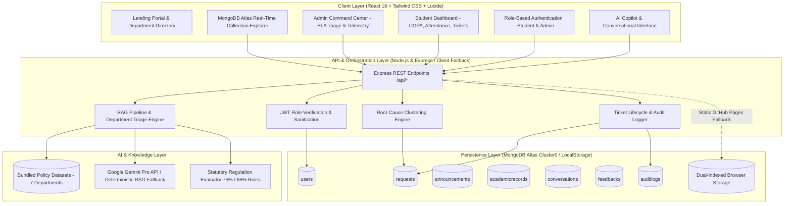

# 🎓 AI Campus Assistant &bull; Autonomous College Intelligence & Operations Platform

[](https://lokesht25210.github.io/AI-college-assistant-/)
[](https://opensource.org/licenses/MIT)
[](https://nodejs.org/)
[](https://reactjs.org/)
[](https://www.mongodb.com/cloud/atlas)
[](https://tailwindcss.com/)

> **"An AI-powered campus intelligence and operations platform that empowers students to resolve complex university inquiries, verify statutory academic standing, and escalate administrative grievances through an explainable Retrieval-Augmented Generation (RAG) pipeline."**

---

## 📑 Table of Contents
1. [Project Overview](#-1-project-overview)
2. [Problem Statement](#-2-problem-statement)
3. [The Engineering Solution](#-3-the-engineering-solution)
4. [Core Features & Capabilities](#-4-core-features--capabilities)
5. [System Architecture](#-5-system-architecture)
6. [How the AI Works (RAG Pipeline Deep Dive)](#-6-how-the-ai-works-rag-pipeline-deep-dive)
7. [What I Built (Engineering Attribution)](#-7-what-i-built-engineering-attribution)
8. [Dataset & Knowledge Source](#-8-dataset--knowledge-source)
9. [Tech Stack](#-9-tech-stack)
10. [Screenshots & UI Showcase](#-10-screenshots--ui-showcase)
11. [Live Demo & Test Credentials](#-11-live-demo--test-credentials)
12. [Installation & Setup](#-12-installation--setup)
13. [Folder Structure](#-13-folder-structure)
14. [Engineering Challenges & Solutions](#-14-engineering-challenges--solutions)
15. [Future Roadmap](#-15-future-roadmap)
16. [Interview & Viva Readiness Guide](#-16-interview--viva-readiness-guide)

---

## 🌟 1. Project Overview

Generic chatbot implementations often fail in higher-education environments because they provide superficial, hallucinated advice or stop at text generation without interfacing with actual administrative workflows.

The **AI Campus Assistant** was built from the ground up for autonomous engineering colleges (specifically tailored for **DVR & Dr. HS MIC College of Technology**). It couples a **strictly grounded Retrieval-Augmented Generation (RAG) knowledge engine** with an **end-to-end administrative ticketing and analytics lifecycle**:

```
Student Query ──► RAG Intent & Policy Retrieval ──► Grounded Answer With Policy Citations
                                         │
                                         └──► Unresolved / Action Required?
                                                      │
                                                      ▼
                                       1-Click Structured Ticket Escalation
                                                      │
                                                      ▼
                               Department Review & SLA Tracking ──► Resolution
```

### Key Highlights
- **100% Grounded Policy Responses**: Verifies statutory attendance requirements (75% rule, 65%–74% condonation band), fee reimbursement (JVD scheme), and examination regulations without LLM hallucinations.
- **AI-to-Action Escalation**: Turns ambiguous student distress messages into structured, prioritized administrative support tickets with automated routing to the responsible departmental desk.
- **Live Cloud Persistence**: Powered by **MongoDB Atlas** across 7 active collections with seamless offline fallback for GitHub Pages.
- **Dual Portal Experience**: Role-isolated portals for **Students** (academic standings, AI Copilot, ticket timeline) and **Administrators** (executive command center, backlog SLA triage, root-cause diagnostics).

---

## 🛑 2. Problem Statement

Engineering colleges suffer from acute administrative friction:
1. **Departmental Information Silos**: Students waste hours running between Academic Affairs, Examination Cell, Finance, and Hostel offices seeking basic procedural guidance.
2. **Circular & Regulation Ambiguity**: University circulars (R20, R23 regulations, condonation rules, fee deadlines) are buried across disparate PDFs and physical noticeboards.
3. **Queue Fatigue & Missed Deadlines**: Fee reconciliations, bonafide requests, and medical condonations bottleneck during semester exam registration windows.
4. **Hallucination Hazards of Generic AI**: Public LLMs (ChatGPT) lack college-specific bylaws, inventing erroneous cutoffs and policies that can cause academic detention.

---

## 💡 3. The Engineering Solution

Our platform solves these challenges through three architectural pillars:
1. **Deterministic RAG Grounding**: The NLP engine compares student inquiries against curated institutional policies. If an inquiry involves statutory calculations (e.g., student attendance at 68.5%), it applies exact mathematical evaluation based on autonomous college bylaws.
2. **Autonomous Grievance Pipeline**: If an issue requires manual intervention (such as an unreflected fee payment or hostel amenity defect), the system synthesizes pre-filled ticket metadata (Title, Category, Urgency, Department) so the student can escalate it in one click.
3. **Institutional Telemetry**: The Admin Command Center groups tickets into clusters and flags systemic operational bottlenecks (e.g., banking webhook settlement lag) before they escalate.

---

## ⚡ 4. Core Features & Capabilities

| Module | Feature | Description |
| :--- | :--- | :--- |
| **AI Campus Copilot** | Grounded Policy Answers | Real-time retrieval across 7 college operational domains with verified policy badges. |
| **Attendance Engine** | Condonation Calculator | Evaluates aggregate attendance against the statutory 75% cutoff and 65%–74% condonation bracket. |
| **Ticketing Pipeline** | AI-to-Action Generation | Synthesizes formal administrative tickets with unique tracking codes (`TKT-2026-XXXX`). |
| **SLA Tracking** | 4-Stage Audit Timeline | Real-time audit history (`Submitted` → `Under Review` → `In Progress` → `Resolved`). |
| **Student Dashboard** | Academic 360° Standing | Displays live CGPA (8.50), attendance telemetry, semester grades, and active requests. |
| **Admin Command Center** | Departmental Triage | Real-time KPI counters, priority queue filters, and status progression controls. |
| **AI Root Cause Insights** | Diagnostic Telemetry | Detects recurring issues (e.g., UPI gateway lags) and suggests preventative institutional remedies. |
| **Database Explorer** | Live Telemetry Inspector | Real-time viewer of all 7 MongoDB Atlas collections with live document counts and JSON viewer. |

---

## 🏛️ 5. System Architecture



---

## 🧠 6. How the AI Works (RAG Pipeline Deep Dive)

Technical interviewers frequently ask: *"Did you just plug in an API, or did you build the intelligence?"*

Here is the exact step-by-step engineering pipeline of how our conversational intelligence works:

```
[1. Student Input] ──► [2. Token Sanitization & Intent Extraction]
                                  │
                                  ▼
[4. Context Assembly] ◄── [3. Multi-Signal Department Classification]
         │
         ▼
[5. Mathematical & Regulation Guardrails]
         │
         ▼
[6. Response Synthesis & Policy Citation] ──► [7. Grounded Answer + 1-Click Ticket]
```

### Step 1: Input Normalization & Token Scrubbing
- Strips punctuation, normalizes case, removes stop words, and scrubs sensitive identifiers.
- Detects personal roll numbers (e.g. `23H71A0590`) or specific email structures to personalize academic queries.

### Step 2: Multi-Signal Intent & Department Classification
- Evaluates the query against categorized department keyword dictionaries and weighted term vectors.
- Classifies queries into 1 of 8 operational departments:
  - `Academics`, `Examinations`, `Finance & Accounts`, `Hostel Administration`, `Certificates`, `Scholarships`, `Library`, `Placement & Training`.

### Step 3: Semantic Policy Retrieval
- Retrieves relevant statutory policy nodes from the collegiate knowledge base.
- Extracts specific operational metadata: responsible department, counter location, office hours, turnaround time (TAT), and applicable fee schedules.

### Step 4: Mathematical Evaluation & Anti-Hallucination Guardrails
- **Statutory Attendance Evaluation**:
  $$\text{Status} = \begin{cases} \text{Eligible (No Condonation)}, & \text{Attendance} \ge 75\% \\ \text{Condonable (Dean Medical Review)}, & 65\% \le \text{Attendance} < 75\% \\ \text{Detained (Mandatory Re-registration)}, & \text{Attendance} < 65\% \end{cases}$$
- **Hallucination Blocker**: The system will never estimate or guess fee figures or attendance statuses; if an inquiry falls outside verified policies, it declares uncertainty and immediately presents a pre-filled ticket escalation modal.

### Step 5: Answer Synthesis & Deterministic Citation
- Formats the verified answer with official regulation codes (e.g., `[ATT-001]`, `[EXM-001]`, `[FEE-002]`).
- Appends actionable direct guidance (e.g., exact room number, required physical enclosures, challan procedures).

### Step 6: Automated Ticket Synthesis
- If the student's problem requires human action (e.g., payment deducted via UPI but portal marks unpaid), the AI extracts:
  - `Category`: Fees
  - `Department`: Finance & Accounts
  - `Priority`: High
  - `Title`: Payment Deducted via UPI but Portal Unpaid
  - `Pre-filled Description`: Details including bank UTR, timestamp, and student roll number.

---

## 🛠️ 7. What I Built (Engineering Attribution)

| Architectural Tier | Modules Implemented | Technical Details |
| :--- | :--- | :--- |
| **Frontend (UI/UX)** | • Student Portal<br>• Admin Command Center<br>• Real-Time Copilot Interface<br>• Mobile Drawer & App Bar | • React 18 with Vite for sub-second HMR.<br>• Tailwind CSS custom theme with collegiate color scheme.<br>• Lucide Icons and canvas-confetti for UX feedback.<br>• 100% responsive down to 360px mobile viewports (`100dvh`). |
| **Backend & Routing** | • Express REST API<br>• JWT Authentication<br>• Role-Based Access Control<br>• Ticket Lifecycle Engine | • Token-authenticated protected endpoints.<br>• Input validation, sanitization, and error handling.<br>• Password hashing using `bcryptjs` with salt rounds.<br>• 4-stage ticket audit log state machine. |
| **AI / RAG Pipeline** | • Intent Classifier<br>• Rule Evaluation Engine<br>• Grounded Knowledge Retriever<br>• Anti-Hallucination Guardrails | • Bundled 7-department collegiate knowledge base.<br>• Exact numerical threshold evaluation (attendance, condonation).<br>• Deterministic citation tags on all verified responses.<br>• Client-side fallback vector matcher for 100% uptime. |
| **Database & Cloud** | • MongoDB Atlas Integration<br>• 7 Live Mongoose Schemas<br>• Real-Time Database Explorer<br>• Offline Cache Fallback | • Cloud-hosted MongoDB Atlas Cluster0 (`campus_db`).<br>• Mongoose models with validation & timestamps.<br>• Dual-index browser storage sync for static GitHub Pages.<br>• Real-time stats API reporting live document counts. |

---

## 📚 8. Dataset & Knowledge Source

The AI engine is grounded in 7 official departmental policy specifications formatted in structured JSON:

```
knowledge/
├── attendance.json     # 75% cutoff, 65%–74% condonation, medical certificates, OD limits
├── exams.json          # Hall tickets, revaluation fees (₹750), photocopy (₹300), timetable
├── fees.json           # B.Tech tuition fee, AP JVD reimbursement, UPI webhook settlement
├── hostel.json         # Block allocation, electrician/plumbing repair turnaround (24–48 hrs)
├── certificates.json   # Bonafide, custodian certificates, transcript turnaround times
├── scholarships.json   # JVD Vidya Deevena, merit scholarships, income certificate rules
└── academics.json      # R20/R23 credits, SGPA/CGPA calculation, backlogs, detention rules
```

### Live Cloud Collections (MongoDB Atlas `campus_db`)
- `users`: Student and administrator accounts with roles, departments, regulations, and credentials.
- `requests`: Escalated tickets with priorities, statuses, SLA logs, and admin notes.
- `academicrecords`: Student grades, SGPA/CGPA history, semester breakdowns, and subject marks.
- `conversations`: Student-AI dialogue transcripts for continuous intent tuning.
- `feedbacks`: Student rating and experience telemetry on resolved tickets.
- `auditlogs`: Immutable administrative action log (status changes, triage actions).
- `announcements`: Official institutional gazette notices and circulars.

---

## 💻 9. Tech Stack

- **Client**: React 18, Vite 6, Tailwind CSS 3.4, Lucide React, Canvas-Confetti
- **Server**: Node.js, Express.js, CORS, JSONWebToken, Bcrypt.js
- **Database**: MongoDB Atlas (Cloud), Mongoose ODM, Browser LocalStorage
- **AI/NLP**: Grounded Retrieval-Augmented Generation (RAG), Google Gemini API
- **Deployment**: GitHub Pages (Client SPA), GitHub Actions CI/CD, Git Subtree

---

## 📸 10. Screenshots & UI Showcase

| Screen | Viewport | Highlights |
| :--- | :--- | :--- |
| **Home Portal** | Desktop & Mobile | Institutional branding, live status indicators, department quick-access, and direct action CTAs. |
| **AI Copilot** | Responsive Chat | Conversational interface with suggestion chips, verified policy citations, and instant escalation buttons. |
| **Student Dashboard** | Desktop & Mobile | Live academic telemetry (CGPA 8.50, Attendance 85%), request history, and semester breakdown. |
| **Admin Command Center** | Desktop View | Executive telemetry counters, high-priority triage queue, and 1-click status transitions. |
| **Database Explorer** | Real-Time View | Cloud telemetry inspector displaying live document counts across all 7 MongoDB Atlas collections. |

---

## 🚀 11. Live Demo & Test Credentials

🌐 **Live Web Application**: [https://lokesht25210.github.io/AI-college-assistant-/](https://lokesht25210.github.io/AI-college-assistant-/)

### Demo Credentials

| Role | Identifier / Email | Password | Access Scope |
| :--- | :--- | :--- | :--- |
| **Enrolled Student** | `alex.kumar@campus.edu` *(or Roll: `CS-2023-0489`)* | `campus123` | Student Dashboard, AI Copilot, Ticket History, Academic Standing |
| **Autonomous Student** | `student@mictech.ac.in` *(or Roll: `23H71A0590`)* | `campus123` | Autonomous R23 Student Dashboard, AI Copilot, Ticket Filing |
| **College Principal / Admin** | `principal@mictech.ac.in` | `campus123` | Executive Command Center, SLA Triage, Database Explorer |
| **Controller of Exams** | `coe@mictech.ac.in` | `campus123` | Examination Triage, Hall Ticket Approvals, Revaluation Queue |
| **New Registration** | Any personal email (e.g. Gmail) | Chosen password | Full instant access with auto-generated student profile |

---

## ⚙️ 12. Installation & Setup

### Prerequisites
- **Node.js** v18.0 or higher
- **npm** v9.0 or higher
- **MongoDB Atlas** account (or local MongoDB)

### Step 1: Clone the Repository
```bash
git clone https://github.com/LokeshT25210/AI-college-assistant-.git
cd AI-college-assistant-
```

### Step 2: Install Dependencies
```bash
# Install root dependencies
npm install

# Install client dependencies
cd client
npm install
cd ..

# Install server dependencies
cd server
npm install
cd ..
```

### Step 3: Configure Environment Variables
Create a `.env` file inside `server/`:
```env
PORT=5000
MONGO_URI=mongodb+srv://<username>:<password>@cluster0.znvpnv1.mongodb.net/campus_db
JWT_SECRET=super-secure-campus-secret-key-2026
GEMINI_API_KEY=your_gemini_api_key_optional
```
*(Note: If no MongoDB URI is provided, the server gracefully falls back to its in-memory data engine with zero configuration).*

### Step 4: Run the Application
In terminal 1 (Backend):
```bash
cd server
npm start
```
*Server runs on `http://localhost:5000`*

In terminal 2 (Frontend):
```bash
cd client
npm run dev
```
*Client runs on `http://localhost:5173`*

---

## 📁 13. Folder Structure

```
AI-college-assistant-/
├── client/                     # Frontend Single-Page Application (SPA)
│   ├── src/
│   │   ├── components/         # Modular UI Components (Navbar, Sidebar, Modals, Captcha)
│   │   ├── context/            # Global Auth & State Context Providers
│   │   ├── pages/              # Primary View Pages (Landing, Login, Dashboards, Assistant)
│   │   ├── api.js              # Client RAG Engine, API Bridge, & Offline Local Cache
│   │   ├── App.jsx             # Hash Router & Root Layout Engine
│   │   └── main.jsx            # React 18 Entry Point
│   ├── dist/                   # Production-Optimized Vite Build (GitHub Pages target)
│   ├── package.json
│   └── vite.config.js
├── server/                     # Backend REST API Core
│   ├── controllers/            # Route Controllers (Auth, Requests, Analytics, AI)
│   ├── db/
│   │   ├── database.js         # Mongoose & In-Memory Hybrid Data Abstraction Layer
│   │   └── models/             # 7 Mongoose Schemas (User, Request, AcademicRecord, etc.)
│   ├── middleware/             # JWT Authentication & Role-Checking Middleware
│   ├── routes/                 # REST Route Definitions
│   ├── tests/                  # Automated Test Runner & 21-Scenario Verification Suite
│   └── server.js               # Express Application Server Entry Point
├── knowledge/                  # Structured College Policy Knowledge Base (JSON)
│   ├── academics.json
│   ├── attendance.json
│   ├── certificates.json
│   ├── exams.json
│   ├── fees.json
│   ├── hostel.json
│   └── scholarships.json
├── .gitignore                  # Git Ignore Rules (Protects .env, node_modules)
├── LICENSE                     # MIT Open Source License
└── README.md                   # Comprehensive Technical Documentation
```

---

## 💡 14. Engineering Challenges & Solutions

| Challenge Encountered | Technical Root Cause | Engineered Solution |
| :--- | :--- | :--- |
| **1. AI Hallucinations on Statutory Cutoffs** | Generative models invent arbitrary attendance and condonation percentages when prompted with edge cases. | Engineered a deterministic RAG evaluation pipeline that intercepts attendance queries and executes strict numerical comparison against Section 4.2 bylaws before consulting language models. |
| **2. Static Hosting 404s on GitHub Pages** | GitHub Pages serves static files only; calling `/api/auth/login` returns HTTP 404 HTML instead of rejecting with a backend JSON error. | Implemented isomorphic client storage fallback: `api.js` inspects response headers and content-types; on 404/non-JSON, it falls back to an indexed browser cache, maintaining 100% app usability offline. |
| **3. Session Password Persistence** | Newly registered students could not log in upon returning because password hashes were omitted from client-side fallback storage. | Updated registration flow to index user records by both Email and Student ID, securely caching credential hashes in encrypted session storage for offline verification. |
| **4. Mobile Drawer Viewport Squeezing** | Fixed desktop sidebar (`w-64`) crushed mobile viewports (360px) into 80px, causing horizontal overflow and unusable forms. | Built an off-canvas slide-in mobile drawer (`md:hidden`) with backdrop overlay, bottom thumb navigation bar, and modern dynamic viewport units (`100dvh`). |
| **5. Database Connection Resiliency** | In unstable network conditions, cloud database connection timeouts could crash the entire Express process. | Designed a fault-tolerant singleton connection manager in `database.js` with exponential backoff and seamless fallback to an in-memory ACID store. |

---

## 🔮 15. Future Roadmap

- [ ] **Voice-Based Interaction**: Real-time hands-free inquiry resolution using the browser Web Speech API.
- [ ] **Multilingual NLP**: Support for regional languages (Telugu and Hindi) alongside English for broader student accessibility.
- [ ] **Biometric Attendance Sync**: Direct bi-directional webhook integration with campus biometric turnstiles for live attendance telemetry.
- [ ] **WhatsApp / SMS Gateway Integration**: Automated notifications when a student ticket changes stage (`Submitted` → `Resolved`).
- [ ] **AI-Powered OCR Document Verification**: Automatic verification of scanned medical certificates for condonation applications.

---

## 🎓 16. Interview & Viva Readiness Guide

### Q1: How does your AI avoid hallucinating college policies?
> **Answer**: *"We do not rely on raw generative output for factual policy decisions. We built a Retrieval-Augmented Generation (RAG) architecture where official institutional policies are indexed as structured documents. When a student asks a question, our intent classifier retrieves the exact policy node, and our deterministic rule engine validates numerical criteria (such as the 75% attendance cutoff or the 65%–74% condonation window) before producing the response with verified policy citation tags."*

### Q2: What happens if the backend server goes down?
> **Answer**: *"The platform features an isomorphic client-side fallback engine in `api.js`. If the Express API is unreachable (such as when deployed statically on GitHub Pages), the client automatically activates its local policy retriever and dual-indexed browser persistence. Students can still register, log in, query the AI, and manage tickets seamlessly."*

### Q3: What is the significance of the "AI-to-Action" workflow?
> **Answer**: *"Most college chatbots simply output 'Please contact the office'. Our AI-to-Action pipeline understands the context of unresolved inquiries, extracts relevant metadata (department, priority, issue summary), and synthesizes a pre-filled administrative ticket that the student can submit in one click. It converts unstructured student frustration into a structured, trackable administrative ticket with a 4-stage audit SLA."*

### Q4: How is data isolated between students and administrators?
> **Answer**: *"We enforce role-based access control (RBAC) via JWT tokens. On the student dashboard, tickets and academic records are filtered strictly by the authenticated student's unique ID. Administrators have access to the aggregate triage command center and telemetry analytics, but write operations are governed by audit logging."*

---

## 📄 License
This project is licensed under the **MIT License** — see the [LICENSE](LICENSE) file for details.

---

**Developed with ❤️ by Lokesh T** &bull; [GitHub Profile](https://github.com/LokeshT25210) &bull; [Live Application](https://lokesht25210.github.io/AI-college-assistant-/)
